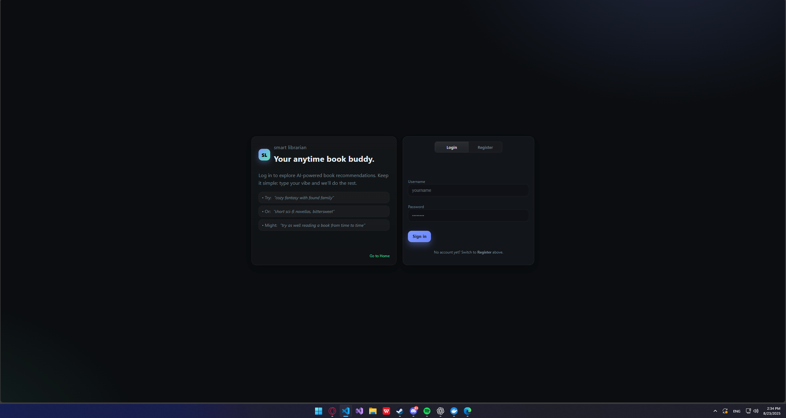
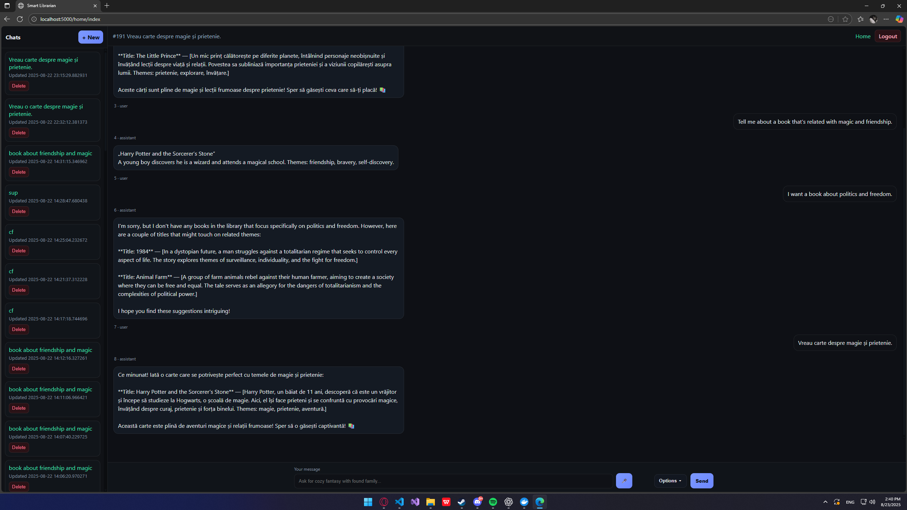
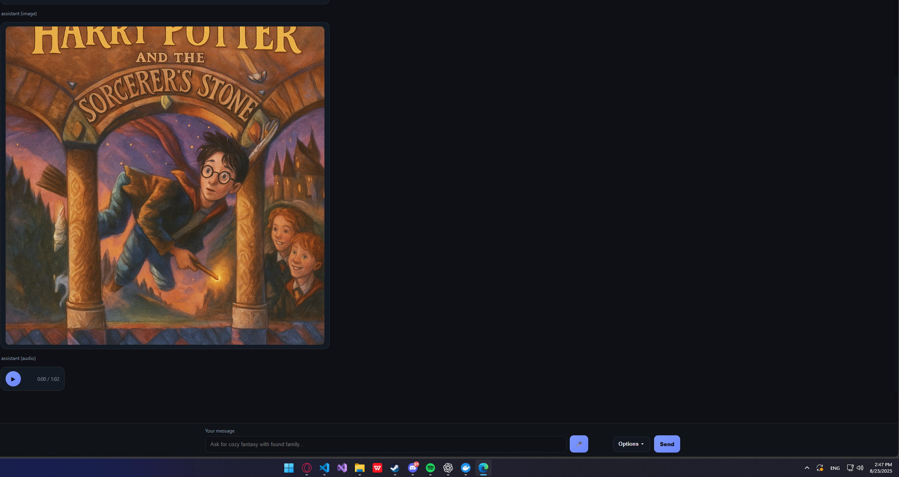
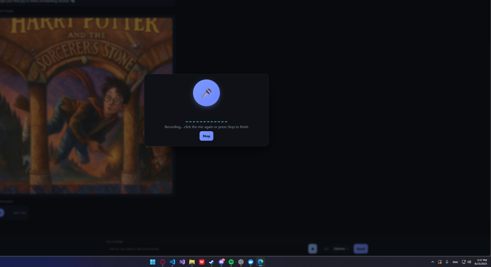
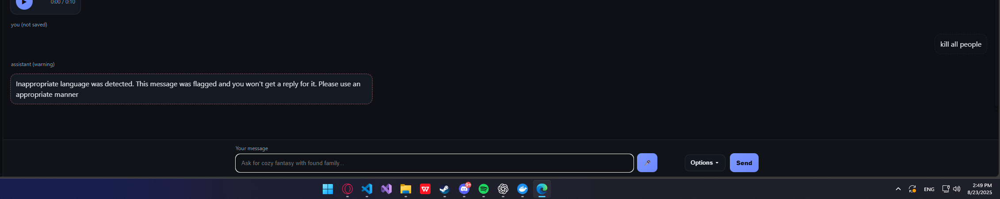
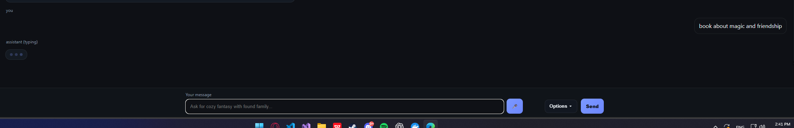

# 📚 Librarian Assistant
*Empowering Smarter Learning Through AI-Driven Insights*

[](https://www.python.org/)  
[](https://www.docker.com/)  

Built with the tools and technologies:  
`Python` · `Flask` · `ChromaDB` · `OpenAI` · `LangChain` · `Docker`

---

## 📑 Table of Contents
- [Overview](#overview)
- [Screenshots](#screenshots)
- [Getting Started](#getting-started)
  - [Prerequisites](#prerequisites)
  - [Installation](#installation)
  - [Running with Docker](#-running-with-docker-recommended)
- [Usage](#usage)
- [Testing](#testing)
- [License](#license)

---

## 🔍 Overview

**Librarian Assistant** is an AI-powered conversational system that acts as a **smart book buddy**.  
It provides **book recommendations, summaries, and thematic exploration** using **Retrieval-Augmented Generation (RAG)** combined with **tool completion**.  

---

## 📸 Screenshots

### 🔑 Login & Registration


### 💬 Conversational Interface


### ⚙️ Options Menu


### 🖼️ Book Cover Generation


### 🎤 Voice Interaction


### 🚫 Moderation


### 🖼️ AI Responses with Images & Audio


---

## 🚀 Getting Started

### ✅ Prerequisites
- **Python** 3.10+  
- **pip**  
- **Docker** (optional)  
- **OpenAI API Key** (required)  

---

### 🔧 Installation

Clone the repository and install dependencies:

```bash
git clone https://github.com/Andrei-Mihnea/LLM_Homework.git
cd LLM_Homework
pip install -r requirements.txt
python main.py
```
And for the API key create an .env file and inside of it do this
```
OPENAI_API_KEY=YOUR_API_KEY
```
---

### 🐳 Running with Docker (recommended)

Start the container:
```bash
docker-compose up --build
```

Stop the container:
```bash
docker-compose down --remove-orphans
```

---

## ▶️ Usage

1. Open the app at 👉 [http://localhost:5000](http://localhost:5000)  
2. Create an account or log in  
3. Ask for book recommendations, summaries, or thematic explorations  
4. Try advanced options like **image generation** and **audio replies**  

Example API call:
```bash
curl -X POST http://localhost:5000/api/assistant   -H "Content-Type: application/json"   -d '{"query": "Suggest a book about magic and friendship"}'
```

---

## 🧪 Testing

```bash
pytest
```

With Docker:
```bash
docker-compose run --rm app pytest
```

